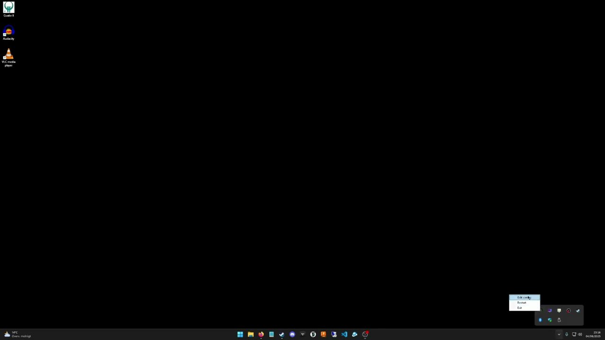

# SetHzMonitor 2.0 is here!

Monitor refresh rate manager

# Overview

SetHzMonitor 2.0 is a lightweight Windows utility that automatically sets your monitor's refresh rate based on running processes, according to mappings defined in a configuration file.

# Features

## Self-contained executable
The app is published as a self-contained binary, so it does not require any pre-installed .NET runtime on the target machine. This makes deployment and usage simpler and more reliable.

## System tray icon with context menu
Runs silently in the system tray with an icon that updates dynamically to show the current refresh rate (Hz). The tray menu includes options to:

- Open the configuration folder
- Restart the app to reload the config without closing
- Exit the app gracefully

## Performance

- Runs efficiently with minimal CPU and memory usage (significantly optimized compared to previous versions requiring .NET runtime).
- The background monitoring loop runs asynchronously to keep the UI responsive.

## Configurable refresh rates

- Define process-to-refresh rate mappings in ProcessHzMap.cfg.
- A default entry is required to specify the fallback refresh rate when no monitored processes are running.

## 📄 License

This project is free for personal and non-commercial use.  
See [License](./LICENSE.md) for full terms.

## ☕ Support the Project

Buy me a coffee via [PayPal](https://www.paypal.com/donate?business=fredrik8801@gmail.com)

## 📬 Contact

Feel free to reach out if you have any questions, feedback, or need support:

- Open an issue on GitHub: https://github.com/freddap/SetHzMonitor/issues
