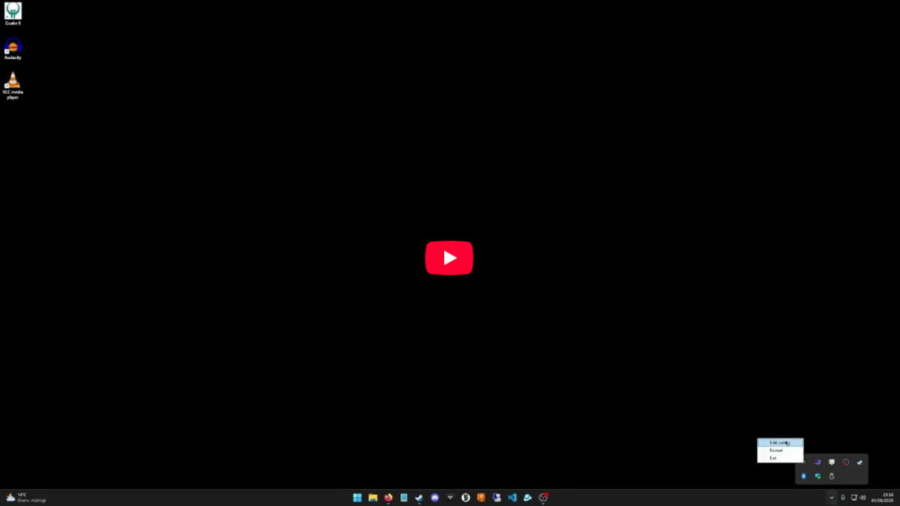

# SetHzMonitor 2.1 is here!

 

  

## Overview

**SetHzMonitor 2.1** is a lightweight Windows utility that automatically adjusts your monitor's refresh rate based on which processes are running, using mappings defined in a simple configuration file.

 Watch SetHzMonitor 2.1 in action on YouTube

## Features

### Self-contained executable

The app is published as a self-contained binary. No pre-installed .NET runtime is required, making it easy to deploy and use.

### Smart background monitoring

- Efficient, low-resource background loop that monitors active processes.
- Designed to keep the UI responsive and use minimal CPU/RAM.
- Async-based and fully optimized compared to older .NET-based versions.

### Refresh rate control

- Define custom Hz settings per process in `ProcessHzMap.cfg`.
- When the refresh rate changes, a notification popup (via `NeonPopup`) shows the current Hz.
- Prevents micro-stuttering that can occur when FPS and Hz are mismatched (e.g., running a game at 60 FPS on a 120 Hz screen).

### System tray integration

Stays quietly in your system tray with a right-click menu that allows you to:
- **Edit config** — Open the `ProcessHzMap.cfg` file directly for editing.
- **Restart** — Reload the config and apply updated settings.
- **Exit** — Close the application gracefully.

## Use case: Smoother VRR experience

For users with Variable Refresh Rate (VRR) displays — such as G-Sync or FreeSync OLED panels — SetHzMonitor can help reduce flickering or gamma/brightness shifts by setting a fixed refresh rate per game.

For example:

- Lock a game like *DOOM Eternal* to 120 Hz if you're targeting 120 FPS.
- Avoid VRR-induced issues by aligning Hz and FPS.
- If a game doesn't support built-in FPS limiting, use [RTSS (RivaTuner Statistics Server)](https://www.guru3d.com/files-details/rtss-rivatuner-statistics-server-download.html) to cap FPS precisely.

## License

This project is free for personal and non-commercial use.  
See [LICENSE.md](./LICENSE.md) for full license details.

## Support the Project

If you like the project and want to support its development:

[Buy me a coffee on PayPal](https://www.paypal.com/donate?business=fredrik8801@gmail.com)

## Contact

Have questions, feedback, or issues?

- Open an issue here on GitHub: https://github.com/freddap/SetHzMonitor/issues
